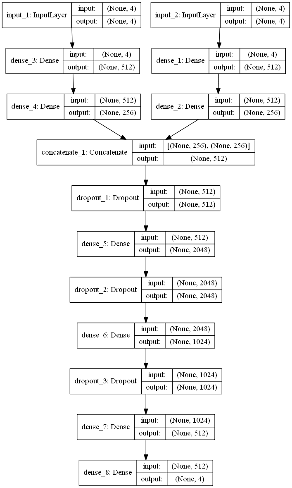

1. Feature extraction based on autoencoder

   - src의 경우 높은 autoencoder의 정확도를 보임
   - 아래의 정확도는 어느정도 복구가 잘 되는지 확인하기 위한 acc임(모델의 성능이 아님)
   - decoder를 통한 복구가 잘 된다는 것은 적절한 feature extration이 수행된 것으로 해석될 수 있음
     
       | feature number | accuracy(mse) |
       |---|---|
       |4|0.000977|
       |5|0.000776|
       |6|0.000892|
       |7|0.000742|
       |8|0.000892|
       |9|0.00086|
       |10|0.000992|

   - dst의 경우 값의 범위가 매우 넓어 autoencoder의 학습이 불가능 함
   - 참고: 코드 내 seed가 설정되어 있지 않아, 할 때마다 결과의 편차 존재
   - source code: `autoencoder.py`

2. XGB regression 

   - k-fold: 5
   - autoencoder를 통해 얻은 feature을 XGB에 활용하여 예측한 결과는 다음과 같음
   - 이 결과는 test셋을 기반으로 dacon에 입력하여 확인할 결과임
   - 현재 4개의 변수를 한번에 예측하도록 구현되었음(추후, 1개의 변수마다 예측할 수 있는 모델 구현하여 성능 확인 필요함)
   - source code: `파일명 추가`

       | feature number | accuracy |
       |---|---|
       |4|확인|
       |5|확인|
       |6|확인|
       |7|확인|
       |8|1.7952100932|
       |9|1.7883265541|
       |10|1.7864689069|

3. POST XGB: MLP

   - Boosting 컨셉으로 에러를 보다 줄이기 위해 MLP를 활용하여 다시 한 번 예측을 수행하도록 만듦
   - validation set을 학습용 데이터 셋의 10%를 사용하되 랜덤하게 샘플링시켜 학습
   - rho는 15,20,25,30 (?) 총 4가지 값이 존재하며, 이를 one-hot encoding하여 별개의 인풋으로 활용함(추가적인 레이어를 더해 처리 후 src와 concat 시킴)
   - train, val MAE는 `acc_post_MLP.csv` 참조
   - model source code: `post_MLP_rho.py`
   - `post_MLP.py`는 validation 셋의 분리가 랜덤하게 되지 않았으며, rho가 반영되지 않은 코드임
   - 결과 차이가 너무 많이 남. 활용된 파일이 올바로 되었는지 확인이 필요할 듯(파이프라인 구축 선행)

       | feature number | accuracy | train MAE | val MAE|
       |---|---|---|---|
       |4|2.049029|0.418655|0.448205|
       |5|2.076052|0.584216|0.614817|
       |6|확인|0.727209|0.744123|
       |7|확인|6.014277|6.020026|
       |8|확인|6.013695|6.022355|
       |9|확인|3.987039|3.987810|
       |10|확인|2.586914|2.593282|

       

1. 다른 데이터 반영 방안 확보 필요할 것으로 보임
2. 추가적으로, PCA 시 4개의 feature가 가장 표현에 가장 적절한 것으로 확인되었음(결과 정리하여 업로드 필요, 혜원)